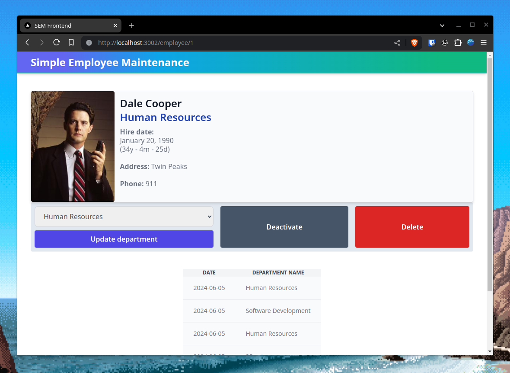

# wsample.front



## Quick start

1. Install dependencies.
   ```sh
   npm install
   ```
 
2. Run **backend project** and then:
   ```sh
   npm run dev
   ```
3. Open [http://localhost:3002/](http://localhost:3002/) on your browser.

## Features

- Next.JS 14.x.
- Usage of AppRouter.
- Typescript.
- Responsive design with Tailwind (not fully polished because of time constraints).
- SSR Streaming with suspense (check *src/components/HistoryTable*).
- Usage of server actions for form submissions.
- ContextApi usage for handling employee modal (check *src/components/EmployeeModal*).
- Included department history (when employees change their department).
